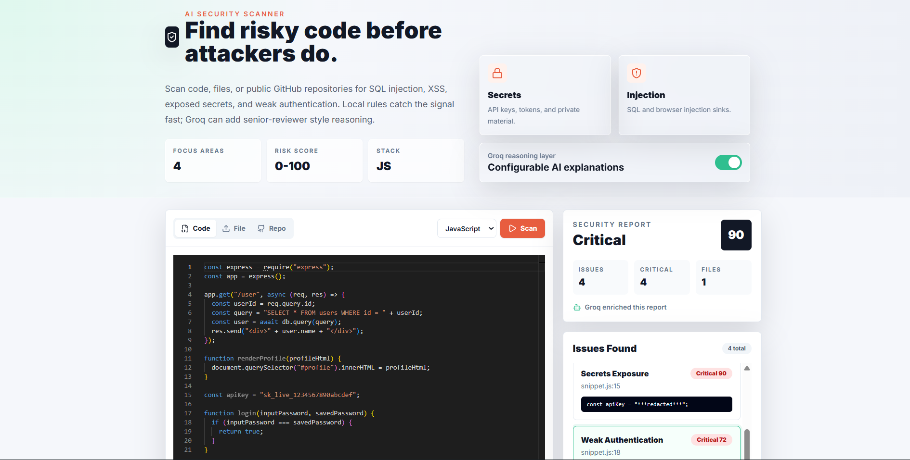

# 🛡️ AI Security Vulnerability Scanner

## HOMEPAGE



---

# 📖 Overview

AI Security Vulnerability Scanner is a full-stack application that helps developers identify security vulnerabilities in source code using both traditional static analysis and AI-powered reasoning.

The platform analyzes JavaScript and TypeScript code for common security flaws such as:

* SQL Injection
* Cross-Site Scripting (XSS)
* Hardcoded Secrets
* Weak Authentication Logic
* Insecure Coding Patterns

Users can paste code, upload files, or scan GitHub repositories and instantly receive detailed vulnerability reports with explanations, remediation steps, secure code examples, and AI-generated insights powered by Groq LLM.

---

# ✨ Features

## 🔍 Static Security Analysis

Built-in rule-based and AST-based scanning detects:

* SQL Injection
* Cross-Site Scripting (XSS)
* Hardcoded API Keys
* Hardcoded Passwords
* Weak Authentication Logic
* Unsafe DOM Manipulation
* Insecure Coding Practices

---

## 🤖 AI-Powered Vulnerability Analysis

Using Groq + Llama:

* Vulnerability Explanation
* Risk Assessment
* Root Cause Analysis
* Exploit Scenario Generation
* Secure Coding Recommendations
* AI Security Insights

---

## 📊 Detailed Security Reports

Every vulnerability includes:

* Vulnerability Type
* Severity Level
* File Location
* Line Number
* Evidence
* Risk Description
* Root Cause
* Exploit Scenario
* Remediation Steps
* Secure Code Example
* Best Practices

---

## 🌐 GitHub Repository Scanning

Scan public repositories directly:

* Repository Source Code Analysis
* Multi-file Security Scanning
* Security Report Generation
* AI-Based Vulnerability Review

---

## 🎨 Frontend Highlights

* Modern Responsive UI
* Monaco Code Editor
* Dark Theme Dashboard
* Real-Time Scan Results
* Interactive Vulnerability Reports
* Detailed Explanation Panels

---

# 🏗️ System Architecture

Source Code / GitHub Repository
│
▼
Static Rule Engine
│
▼
AST Security Analysis
│
▼
Vulnerability Detection
│
▼
Groq AI Analysis
│
▼
Detailed Security Report
│
▼
Developer Recommendations

---

# 🛠️ Tech Stack

## Frontend

* React.js
* Vite
* Tailwind CSS
* Monaco Editor
* Axios

## Backend

* Node.js
* Express.js
* Babel Parser
* Axios
* Dotenv
* CORS

## AI Layer

* Groq SDK
* Llama 3.3 70B Versatile

## Security Analysis

* AST Traversal
* Static Rule Engine
* Pattern Matching
* Security Heuristics

---

# 📂 Project Structure

ai-security-vulnerability-scanner/

├── frontend/

│   ├── src/

│   ├── public/

│   └── package.json

│

├── backend/

│   ├── src/

│   │   ├── routes/

│   │   ├── services/

│   │   ├── scanners/

│   │   ├── utils/

│   │   └── server.js

│   │

│   ├── .env.example

│   └── package.json

│

├── .gitignore

├── package.json

└── README.md

---

# ⚙️ Installation

## Clone Repository

```bash
git clone https://github.com/YOUR_USERNAME/ai-security-vulnerability-scanner.git

cd ai-security-vulnerability-scanner
```

---

# 🔧 Backend Setup

Install dependencies:

```bash
cd backend

npm install
```

Create `.env`

```env
PORT=5000

CLIENT_ORIGIN=http://localhost:5173

GROQ_API_KEY=your_groq_api_key

GROQ_MODEL=llama-3.3-70b-versatile
```

Run Backend:

```bash
npm run dev
```

Backend URL:

```text
http://localhost:5000
```

---

# 💻 Frontend Setup

Open a new terminal:

```bash
cd frontend

npm install

npm run dev
```

Frontend URL:

```text
http://localhost:5173
```

---

# 📡 API Endpoints

## Scan Source Code

### POST

```http
/api/scan
```

### Request Body

```json
{
  "code": "const query = 'SELECT * FROM users WHERE id=' + req.query.id;",
  "language": "javascript",
  "fileName": "app.js",
  "useAI": true
}
```

---

## Scan GitHub Repository

### POST

```http
/api/scan/repository
```

### Request Body

```json
{
  "repositoryUrl": "https://github.com/user/repository",
  "useAI": true
}
```

---

# 🧪 Vulnerabilities Detected

| Vulnerability              | Severity |
| -------------------------- | -------- |
| SQL Injection              | Critical |
| Cross-Site Scripting (XSS) | High     |
| Hardcoded Secrets          | High     |
| Hardcoded Passwords        | High     |
| Weak Authentication        | Medium   |
| Unsafe DOM Manipulation    | High     |
| Insecure API Usage         | Medium   |

---

# 📋 Example Security Finding

### SQL Injection

**Severity:** Critical

**Issue**

```javascript
const query =
  "SELECT * FROM users WHERE id=" + req.query.id;
```

**Why It Matters**

An attacker can manipulate database queries by injecting malicious SQL statements.

**Secure Alternative**

```javascript
const query =
  "SELECT * FROM users WHERE id = ?";

db.query(query, [req.query.id]);
```

---

# 🚀 Future Improvements

* Authentication System
* User Dashboard
* Scan History
* PDF Report Export
* Docker Deployment
* CI/CD Security Pipeline
* Multi-Language Support
* OWASP Top 10 Coverage Expansion
* Team Collaboration Features
* Real-Time Repository Monitoring

---

# 🧠 What I Learned

This project helped me learn:

* Full-Stack JavaScript Development
* React + Vite Architecture
* Express Backend Development
* Static Code Analysis
* AST Parsing & Traversal
* Security Vulnerability Detection
* Groq AI Integration
* Prompt Engineering
* API Design
* Frontend-Backend Communication
* Secure Coding Practices

---

# 🎯 Project Goals

The objective of this project is to help developers identify and fix security vulnerabilities before deployment by combining traditional static analysis with modern AI-powered security insights.

This approach provides both fast automated detection and meaningful explanations that help developers understand the security risks in their code.

---

# 🎥 Demo Video

🔗 https://youtu.be/Is1z0A5To1U

---

